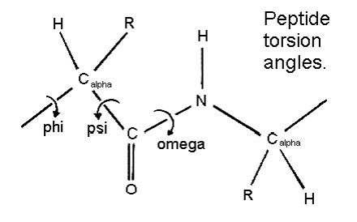

# Amino Acids

### How Amino Acids Bind Together? - Peptide Bond

###Definitions
- **Aliphatic Amino Acids**   
Aliphatic R groups are **non-polar** and **hydrophobic**. Hydrophobicity increases with increasing number of **C** atoms in the hydrocarbon chain. Although these amino acids ***prefer to remain inside protein molecules***, alanine and glycine are ambivalent, meaning that they can be inside or outside the protein molecule. Glycine has such a small side chain that it does not have much effect on the hydrophobic interactions.   

- **Essential AAs** -
body can't synthesise the molecule and so it must be obtained from the diet.

- **Covalent** -
bonds involve atoms that are willing to share electrons with each other to stay bonded.

- **Polar covalent bonds** -
pair of electrons are unequally shared between atoms. One atoms spends more time with electrons than the other. So the atom that spends more time with electrons has a slight negative charge. Vice versa with the atom that spends less time.

- **Non-polar *covalent* bond**
refers to those atoms that share an equal number of electrons with each other. There is no hogging of electrons. They are very strong bonds. Take lots of energy to break - ***peptide bond*** is non-polar covalent bond.

- **Hydrophobicity**
refers to an atom's or a molecule's extreme dislike for water. In relationship to non-polar bonding, a molecule that is *hydrophobic is categorized as non-polar*. While these molecules love sharing electrons with each other, when placed in a solution containing water, the process of sharing ceases to exist!

- **Methyl group**
carbon bonded to 3 hydrogens - $CH_3$. It's a saturated hydrocarbon (type of alkyl) derived from Methane ($CH_4$).

- **Methylene group** - carbon bonded to 2 hydrogens -  $CH_2$

- **Hydrocarbons** are compounds that only contain carbons or hydrogens.

- **Alpha carbon (α carbon)** in organic molecules refers to the *first carbon atom* that attaches to a functional group, such as a carbonyl or the *R-group*.   

- **Beta carbon (β carbon)** - The second carbon atom.   
The system continues naming in alphabetical order with Greek letters. The functional group in question determines which letter we assign to a carbon (see figure below right)

- **Amino group (NH_2)** = Weakly basic. An organic compound that contains an amino group is called an **amine**. Amines are derivatives of the inorganic compound ammonia, ($NH_3$).

- **Carboxyl group ($COOH$)** = weakly acidic. Contains both a **carbonyl ($CO$)** and a **hydroxyl group ($OH$)**. Carboxyl groups frequently ionize, releasing the H from the hydroxyl group as a free proton ($H^+$), with the remaining O carrying a negative charge. This charge "flip-flops" back and forth between the two oxygen atoms, which makes this ionized state relatively stable. (Hydroxyl groups sometimes ionize momentarily, but the resulting ionic forms are not stable and the ions immediately rejoin). Molecules containing carboxyl groups are called **carboxylic acids** and dissociate partially into $H^+$ and $COO^−$.   

- **Acids** -
ionic compounds that break apart in water to form a hydrogen ion ($H^+$). The strength of an acid is based on the concentration of $H^+$ ions in the solution. The more $H^+$ the stronger the acid.
    - Acids taste sour
    - Acids react strongly with metals ($Zn$ + $HCl$)
    - Strong Acids are dangerous and can burn your skin   
- **Bases** -
ionic compounds that break apart to form a negatively charged hydroxide ion ($OH^-$) in water.
The strength of a base is determined by the concentration of Hydroxide ions ($OH^-$). The greater the concentration of $OH^-$ ions the stronger the base.
    - Bases taste bitter
    - Bases feel slippery
    - Strong bases are very dangerous and can burn your skin.   

- **ionic compund** - a compound with a positive or negative charge.

- **Isopropyl group** =

- **Torsion Angles**   
**Phi (ϕ)** - *Describes rotation about $N-C^α$*.     
**Psi (ψ)** - *Describes rotation about $C^α-C$*.   
**Omega (ω)** - *Describes rotation about $C-N$*. Cis = $0^{\circ}$, Trans = $180^{\circ}$   

## Residues

####Glycine, Gly, G - Aliphatic   

- ***Side Chain ( R )*** = Hydrogen ($H$)
- ***Simplest*** & ***smallest*** amino acid
- Very ***flexible***
- Gly is opposite of Pro (Pro = inflexible)
- Neither polar or non-polar
- No charge
##
####Alanine, Ala, A - Aliphatic   

- ***Side Chain ( R )*** = Methyl group ($CH_3$)
- All amino acids are derivatives of alanine (except Glycine).
- No charge

##
####Valine, Val, V - Aliphatic   

- ***Side Chain ( R )*** = Isopropyl group
- Two methyl groups added to Ala to make an isopropyl group
- Shaped like a "V"
- No charge

##
####Leucine, Leu, L - Aliphatic

- ***Side Chain ( R )*** = Isopropyl group added to a methylene ($CH_2$)
- It's an **essential** AA.
- No charge

##
####Isoleucine, Ile, I - Aliphatic

- ***Side Chain ( R )*** = isomer of Leucine
- Ile is a structural isomer of Leu
- also has 4 $C$'s' in side chain.
- Bulkier than Leu near the base $R$ (size/shape of side chains is important).
- Ile has a 2nd chiral centre.

##
####Proline, Pro, P - Aliphatic

- ***Side Chain ( R )*** = 3 carbon chain bonded in a ring.
- It's inflexible due to the ring structure.
- structurally important and found in turns.
