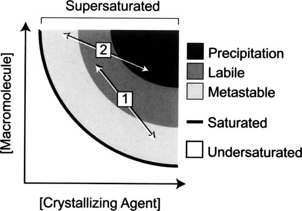
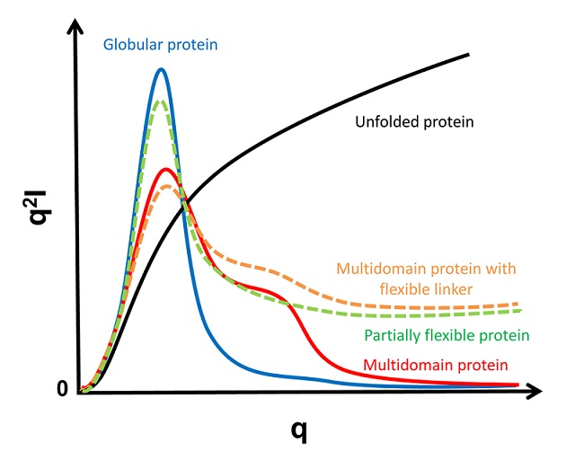

# Possible (generic style) thesis questions...

### Introduction Chapter
> What forms of post-translational modification exist?

- **Glycosylation** - reaction in which a carbohydrate is attached to a hydroxyl or other functional group of another molecule.   
**Ubiquitination** - addition of ubiquitin to a substrate protein

> What are chromatography, filtration and precipitation with regard to purification?

- **Chromatography** - exploit physical properties of either the target protein or the other elements in the solution. Using various paper, gas or liquid chromatography methods, the protein and its surrounding elements are typically dissolved in a mixture and then passed through a stationary phase prior to analysis.  
**Centrifugation, filtration, sonication** - can be used to break up and remove the cell parts that surround and contain the target protein, like cell membranes and DNA.   
**precipitation** - ammonium sulphate is added to solution and protein samples are gathered and concentrated as they precipitate.

> What factors affect crystallogenesis?

- Both environmental variables (such as temperature) and chemical variables (type and concentration of chemicals and the solution pH).
   
Drop volume ratio effect on supersaturation. We try to get into the labile zone where spontaneous homogeneous nucleation will occur. Varying conditions will vary where we are on the curve.

> What does it mean for a protein to be chiral?

**Chiral** - asymmetric in such a way that the structure and its mirror image are not superimposable. ***Proteins are chiral molecules so they exist as single enantiomers***.   
**Enantiomer** - each of a pair of molecules that are mirror images of each other.

> What is diffraction?

- It is the process by which a beam of light or other system of waves is spread out as a result of passing through a narrow aperture or across an edge, typically accompanied by interference between the wave forms produced.

> Why can the beam vector lengths $\boldsymbol{s}$ and $\boldsymbol{s}_0$ be chosen arbitrarily?

- I believe this is just because of the geometric setup. We don't actually show the origin of the X-ray source or the detector in the derivation.

> Derive $p + q = \lambda[\boldsymbol{r} \cdot (\boldsymbol{s}_0 - \boldsymbol{s})]$

- The steps to remember:
    - The dot product $\boldsymbol{r} \cdot \boldsymbol{s}$ is the projection of $\boldsymbol{r}$ in the direction of $\boldsymbol{s}$.
    - If $\boldsymbol{s}$ is in the opposite direction to $\boldsymbol{r}$ then the dot product is negative.
    - Remember that we don't care about the lengths of $\boldsymbol{s}$ when finding the projection. We want a unit length. So if $|\boldsymbol{s}| = 1/\lambda$, then we need to multiply by $\lambda$.

> What is an absorption edge?

An **absorption edge** is a sharp discontinuity in the absorption spectrum of a substance. They occur at wavelengths where the energy of an absorbed photon corresponds to an electronic transition or ionization potential.   
A particle that is bound — confined spatially — can only take on certain discrete values of energy known as **energy levels**. An **electronic transistion** is when an electron "jumps" to a higher energy level.

> What properties might a Kratky plot of a multimeric molecule possess?

- $q^2 \times I(q)$ vs $q$ plot i.e. a Kratky plot".

> What is a redox reaction?

**Redox** reactions involve *oxidation* and *reduction* occurring simultaneously.   
**Oxidation** - ***loss*** of electrons   
**Reduction** - ***gain*** of electrons

> What are the data quality metrics in Crystallography e.g. (R values, correlation coefficients)

> Explain the "within a factor of 2" statement

> For Fourier difference map analysis why are the phases not refined for the later datasets?

> Why might dose rate effects not have an effect at cryo temperatures?

### DWD Chapter

> Why would you use linear fitting procedures over non-linear ones and what's the difference?

### Data Reduction Chapter

> What's the difference between the profile fitted and the summed intensity estimates?

> What is the Lorentz-Polarisation correction factor

### SAXS Chapter

> With regard to SAXS radioprotectants, what are DTT and TCEP

> What's the difference between **radioprotectant** and **radical scavenger**?

***Radioprotectants*** - compounds that either react with secondary radicals before they have a chance to damage the protein (i.e. they reduce indirect damage), or by interacting with the already damaged residue in such a way as to repair it to a predamaged state before further damaging reactions can occur (O’Neill et al., 2002).
***Radical scavengers*** - compounds which reduce indirect damage by reacting with an externally produced radical that could have subsequently inflicted damage if it had reached the protein.

> What is Scheffe post hoc analysis?

At the moment I have no idea.

> What is the Bonferroni correction?

$$P_{adj}(>C) = m \times P(>C)$$

where $m$ is the number of tests.
Bonferroni adjustments are necessary when making multiple comparisons because they keep the Type I error rate from being inflated.
